---
title: "Network Topology Diagram"
uid: "infra-network-topology"
kind: [infrastructure, network, diagram]
category: "01"
sub-category: "02"
visibility: 3.0
status: 4.0
tags: [network, topology, diagram, mermaid, switches, hosts, endpoints, wifi]
parent_uid: ""
---

# Network Topology Diagram

**Category:** 01.02 - Networking Infrastructure  
**Purpose:** Visual network topology for VOS homelab  
**Updated:** 2025-12-28

## Overview

Dual-zone architecture. Backend (200-250) has no internet, trusted. Frontend (100-150) has firewalled internet, untrusted. Management (254) for physical infrastructure.

## Security Zones

```mermaid
flowchart TB
    subgraph INTERNET["🌐 INTERNET"]
        WAN["WAN"]
    end

    subgraph OPNSENSE["🔥 OPNsense"]
        FW["Firewall & Router"]
    end

    subgraph FRONTEND["🟢 FRONTEND (100-150)"]
        direction TB
        F_DESC["Firewalled Internet
SMB Storage
Untrusted Zone"]
    end

    subgraph BACKEND["🔵 BACKEND (200-250)"]
        direction TB
        B_DESC["❌ NO INTERNET
NFS Storage
Trusted Zone"]
    end

    subgraph MGMT["🟡 MANAGEMENT (254)"]
        direction TB
        M_DESC["Admin Only
Infrastructure"]
    end

    WAN --> FW
    FW -->|"Firewalled"| FRONTEND
    FW -->|"BLOCKED"| BACKEND
    FW -->|"Admin"| MGMT

    FRONTEND -->|"Via Proxy"| BACKEND

    classDef internet fill:#ff6b6b,stroke:#cc5555,color:#fff
    classDef firewall fill:#ffa94d,stroke:#cc8844,color:#000
    classDef frontend fill:#69db7c,stroke:#55aa66,color:#000
    classDef backend fill:#4dabf7,stroke:#3388cc,color:#fff
    classDef mgmt fill:#ffd43b,stroke:#ccaa33,color:#000

    class WAN internet
    class FW firewall
    class FRONTEND,F_DESC frontend
    class BACKEND,B_DESC backend
    class MGMT,M_DESC mgmt
```

## Complete Physical Topology

```mermaid
flowchart TB
    subgraph INTERNET["🌐 INTERNET"]
        ZIGGO["Ziggo Modem<br/>Bridge Mode"]
    end

    subgraph EDGE["🔥 EDGE ROUTER"]
        OPNSENSE["hal<br/>Qotom Q20331G9<br/>OPNsense<br/>C3758R 8C | 64GB"]
    end

    subgraph SWITCHES["📡 SWITCHES"]
        subgraph FRONTEND_SW["Frontend 1GbE"]
            ZYXEL["Zyxel GS1900-24HP<br/>24× 1GbE PoE + 2× SFP<br/>170W Budget"]
        end
        subgraph BACKEND_SW["Backend 10GbE"]
            ONTI["ONTI S508CL-8S<br/>8× 10G SFP+"]
            TENDA["Tenda TEM2007<br/>7× 2.5G + 1× SFP+"]
        end
    end

    subgraph COMPUTE["💻 COMPUTE NODES"]
        BREIN["🧠 deep-thought<br/>HX310 J6426<br/>Core Services<br/>32GB"]
        DOWNLOAD["📥 napster<br/>HX310 J6426<br/>*ARR Stack<br/>32GB"]
        HOOFD["📖 skynet<br/>CWWK 8845HS<br/>AI Controller<br/>64GB"]
        KLUS["🔧 mothership<br/>B450M 5800X<br/>Docker Worker<br/>32GB"]
        DENK["🤖 watson<br/>X99 2×E5-2686v4<br/>AI GPU 2×A770<br/>128GB"]
    end

    subgraph STORAGE["🗄️ STORAGE"]
        NAS["alexandria<br/>Unraid NAS<br/>R5 3600 | 32GB<br/>8×16TB = 117TB"]
    end

    subgraph WIFI["📶 WIFI MESH"]
        subgraph INDOOR["Indoor APs"]
            AP1["RT-2980 #1<br/>Living Room"]
            AP2["RT-2980 #2<br/>Office"]
            AP3["RT-2980 #3<br/>Bedroom"]
        end
        subgraph REMOTE["Remote APs"]
            AP4["🔐 RT-2980 #4<br/>Basement<br/>WireGuard"]
            AP5["🔐 RT-2980 #5<br/>Garage<br/>WireGuard"]
        end
    end

    ZIGGO -->|WAN| OPNSENSE
    OPNSENSE -->|"LACP 2×1G<br/>P25-26"| ZYXEL
    OPNSENSE -->|"SFP+ 10G<br/>P1"| ONTI
    ONTI -->|"SFP+ 10G<br/>P2"| TENDA

    ZYXEL -->|"P1"| BREIN
    ZYXEL -->|"P2"| DOWNLOAD
    ZYXEL -->|"P3 PoE"| AP1
    ZYXEL -->|"P4 PoE"| AP2
    ZYXEL -->|"P5 PoE"| AP3

    ONTI -->|"P3 DAC"| KLUS
    ONTI -->|"P5 AOC"| DENK
    ONTI -->|"P6 AOC"| NAS

    TENDA -->|"P1"| BREIN
    TENDA -->|"P2"| DOWNLOAD
    TENDA -->|"P3"| HOOFD

    classDef internet fill:#ff6b6b,stroke:#cc5555,color:#fff
    classDef router fill:#ffa94d,stroke:#cc8844,color:#000
    classDef frontend fill:#69db7c,stroke:#55aa66,color:#000
    classDef backend fill:#4dabf7,stroke:#3388cc,color:#000
    classDef server fill:#748ffc,stroke:#5566cc,color:#fff
    classDef storage fill:#20c997,stroke:#188866,color:#fff
    classDef wifi fill:#da77f2,stroke:#aa55cc,color:#000
    classDef remote fill:#f783ac,stroke:#cc6688,color:#000

    class ZIGGO internet
    class OPNSENSE router
    class ZYXEL frontend
    class ONTI,TENDA backend
    class BREIN,DOWNLOAD,HOOFD,KLUS,DENK server
    class NAS storage
    class AP1,AP2,AP3 wifi
    class AP4,AP5 remote
```

## VLAN Zone Map

## Management VLAN 254 Layout

## Endpoint Devices

```mermaid
flowchart TB
    subgraph WIFI_MESH["📶 WiFi Mesh"]
        AP1["RT-2980 #1"]
        AP2["RT-2980 #2"]
        AP3["RT-2980 #3"]
    end

    subgraph ENDPOINTS["📱 ENDPOINTS"]
        subgraph DEV["Development (VLAN 101)"]
            IZOMBIE["🖥️ iZombie<br/>iMac 2014 Arch"]
            X300["🖥️ X300<br/>ASRock 5700G"]
        end
        subgraph MEDIA["Media (VLAN 112)"]
            H96["📺 H96 MAX V58<br/>RK3588"]
        end
        subgraph MOBILE["Mobile (VLAN 111)"]
            ARMOR["📱 Armor Pad 4"]
            A55_1["📱 Samsung A55-1"]
        end
        subgraph WORK["Work (VLAN 120)"]
            A55_2["📱 Samsung A55-2"]
            HP["💼 HP Laptop"]
        end
        subgraph IOT["IoT (VLAN 112)"]
            TUYA["🏠 Tuya Devices"]
        end
    end

    AP1 -.-> IZOMBIE
    AP1 -.-> H96
    AP2 -.-> X300
    AP2 -.-> HP
    AP1 -.-> ARMOR
    AP1 -.-> A55_1
    AP1 -.-> A55_2
    AP1 -.-> TUYA

    classDef ap fill:#da77f2,stroke:#aa55cc
    classDef dev fill:#4dabf7,stroke:#3388cc,color:#000
    classDef media fill:#ffa94d,stroke:#cc8844,color:#000
    classDef mobile fill:#69db7c,stroke:#55aa66,color:#000
    classDef work fill:#748ffc,stroke:#5566cc,color:#fff
    classDef iot fill:#ffd43b,stroke:#ccaa33,color:#000

    class AP1,AP2,AP3 ap
    class IZOMBIE,X300 dev
    class H96 media
    class ARMOR,A55_1 mobile
    class A55_2,HP work
    class TUYA iot
```

## Storage Access Model

## Reverse Proxy Flow (VLAN 150)

## Switch Port Assignments

### Zyxel GS1900-24HP (Frontend)

| Port | Device | VLAN | Notes |
|------|--------|------|-------|
| P1 | deep-thought | 254 | Frontend NIC |
| P2 | napster | 254 | Frontend NIC |
| P3 | RT-2980 #1 | Trunk | PoE, Living Room |
| P4 | RT-2980 #2 | Trunk | PoE, Office |
| P5 | RT-2980 #3 | Trunk | PoE, Bedroom |
| P6 | Hisource | - | PoE, Balcony |
| P7 | Hasivo | - | PoE, Basement |
| P8 | iZombie | 101 | Wired dev |
| P9 | X300 | 101 | Wired dev |
| P10 | H96 | 112 | Media box |
| P25-26 | OPNsense | Trunk | LACP uplink |

### ONTI S508CL-8S (Backend 10G)

| Port | Device | Connection | Notes |
|------|--------|------------|-------|
| P1 | hal | SFP+ | OPNsense |
| P2 | Tenda | SFP+ | 2.5G bridge |
| P3 | mothership | DAC 1.0m | X520-DA1 |
| P4 | - | Reserved | skynet Phase 2 |
| P5 | watson | AOC 7m | X520-DA1 M.2 |
| P6 | alexandria | AOC 7m | X520-DA1 |

### Tenda TEM2007 (Backend 2.5G)

| Port | Device | Notes |
|------|--------|-------|
| SFP+ | ONTI P2 | 10G uplink |
| P1 | deep-thought | eth1 |
| P2 | napster | eth1 |
| P3 | skynet | eth1 2.5G |

## Related

- [[homelab/network/ip-plan]]
- [[homelab/network/vlan-design]]
- [[homelab/network/architecture]]
- [[homelab/hosts]]